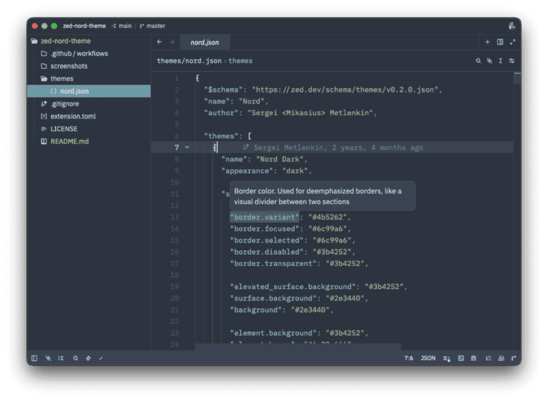
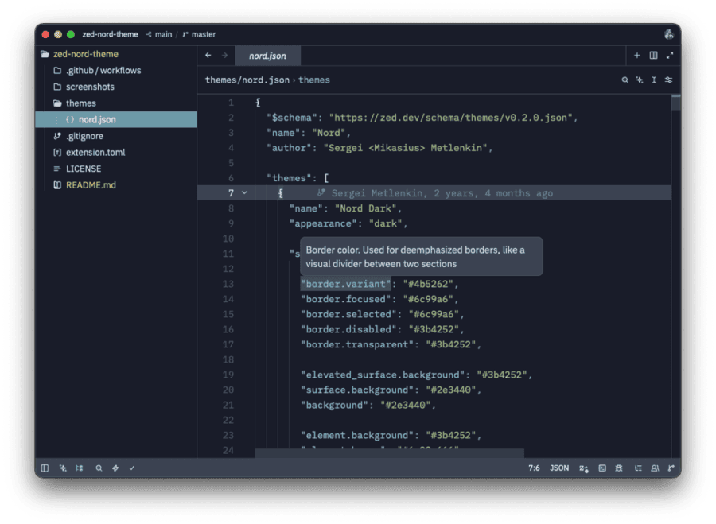
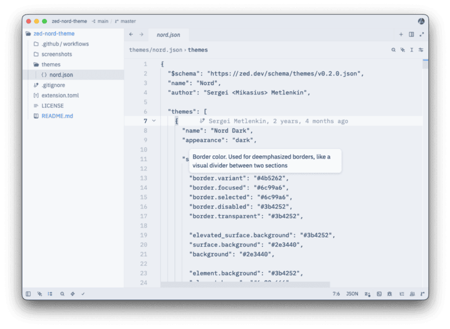

# zed-nord-theme

Created with ❤

- https://zed.dev/theme-builder
- https://zed.dev/docs/extensions/themes
- https://zed.dev/blog/user-themes-now-in-preview

Thanks to:

- https://github.com/huytd/vscode-nord-light
- https://www.nordtheme.com/ports/visual-studio-code

Place `nord.json` in `~/.config/zed/themes`, restart Zed and select it from the command palette (`Ctrl/Cmd+Shift+P`) or (`Ctrl/Cmd+K Ctrl/Cmd+T`).

Also this theme was added to [Zed extensions](https://github.com/zed-industries/extensions)

## Screenshots

*Nord Dark*

*Nord Darker*

*Nord Light*

Notes: full-resolution originals and other intermediate files are archived in screenshots/archive. Images in /screenshots are trimmed and optimized for direct display in README. For smaller repo size consider using WebP in releases or Git LFS for very large sources.
